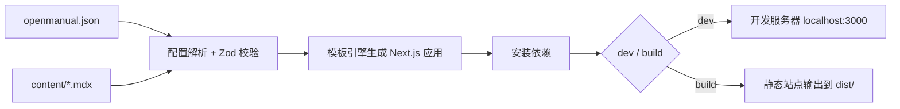

<div align="center">
  <br />  
  <br />  
  
  <br />  
  <br />  
  <br />  
</div>

<div align="center">

[](https://github.com/shenjingnan/openmanual/actions/workflows/ci.yml)
[](https://www.npmjs.com/package/openmanual)
[](https://www.npmjs.com/package/openmanual)
[](https://codecov.io/gh/shenjingnan/openmanual)
[](https://opensource.org/licenses/MIT)

</div>

AI 友好的开源文档系统框架。只需编写 Markdown/MDX 文档和 JSON 配置，即可自动生成基于 Next.js 的完整文档站点。

## 特性

- **零配置起步** — 最小只需 `name` 字段和 `content/index.mdx` 即可启动
- **代码生成模式** — 通过模板引擎生成 Next.js 应用，用户无需接触框架代码
- **Zod 校验** — 配置文件使用 Zod Schema 严格校验，错误提示清晰
- **灵活导航** — 支持多分组侧边栏、自定义图标、折叠控制
- **主题定制** — 通过 `primaryHue` 色相值轻松调整品牌色
- **全文搜索** — 内置搜索功能，一行配置开启
- **MDX 增强** — 支持 React 组件、LaTeX 公式
- **AI 原生设计** — 纯 JSON 配置 + Markdown 内容，非常适合 AI 辅助生成

## 快速开始

### 安装

```bash
npm install -g openmanual
```

### 创建项目

```bash
# 1. 创建项目目录
mkdir my-docs && cd my-docs

# 2. 创建配置文件（最小配置）
cat > openmanual.json << 'EOF'
{
  "name": "My Docs"
}
EOF

# 3. 创建首页文档
mkdir content
cat > content/index.mdx << 'EOF'
---
title: 欢迎使用
---

# Hello OpenManual

这是我的第一篇文档。
EOF

# 4. 启动开发服务器
openmanual dev
```

访问 `http://localhost:3000` 即可看到文档站点。

## CLI 命令

| 命令 | 说明 |
|------|------|
| `openmanual dev` | 启动开发服务器（默认端口 3000） |
| `openmanual dev -p 8080` | 指定端口启动 |
| `openmanual build` | 构建静态站点 |
| `openmanual preview` | 预览构建产物（默认端口 8080） |
| `openmanual preview -d ./out` | 指定产物目录预览 |

## 配置参考

在项目根目录创建 `openmanual.json`：

```json
{
  "name": "My Docs",
  "description": "项目文档",
  "contentDir": "content",
  "outputDir": "dist",
  "siteUrl": "https://docs.example.com",
  "locale": "zh",
  "navbar": {
    "logo": "/logo.svg",
    "github": "https://github.com/user/repo",
    "links": [
      { "label": "Blog", "href": "https://blog.example.com" }
    ]
  },
  "footer": {
    "text": "Built with OpenManual"
  },
  "sidebar": [
    {
      "group": "快速开始",
      "icon": "Rocket",
      "collapsed": false,
      "pages": [
        { "slug": "getting-started", "title": "安装指南", "icon": "Download" },
        { "slug": "configuration", "title": "配置说明", "icon": "Settings" }
      ]
    },
    {
      "group": "进阶",
      "collapsed": true,
      "pages": [
        { "slug": "advanced/theme", "title": "主题定制" },
        { "slug": "advanced/search", "title": "搜索配置" }
      ]
    }
  ],
  "theme": {
    "primaryHue": 240,
    "darkMode": true
  },
  "search": {
    "enabled": true
  },
  "mdx": {
    "latex": true
  }
}
```

### 配置字段说明

| 字段 | 类型 | 必填 | 默认值 | 说明 |
|------|------|------|--------|------|
| `name` | string | 是 | — | 站点名称 |
| `description` | string | 否 | — | 站点描述 |
| `contentDir` | string | 否 | `content` | 文档内容目录 |
| `outputDir` | string | 否 | `dist` | 构建产物输出目录 |
| `siteUrl` | string | 否 | — | 站点 URL |
| `locale` | string | 否 | — | 站点语言 |
| `navbar.logo` | string | 否 | — | Logo 图片路径 |
| `navbar.github` | string | 否 | — | GitHub 仓库链接 |
| `navbar.links` | array | 否 | — | 导航栏链接列表 |
| `footer.text` | string | 否 | — | 页脚文本 |
| `sidebar[].group` | string | 是 | — | 分组名称 |
| `sidebar[].icon` | string | 否 | — | 分组图标 |
| `sidebar[].collapsed` | boolean | 否 | `false` | 是否默认折叠 |
| `sidebar[].pages[].slug` | string | 是 | — | 页面 slug（对应文件路径） |
| `sidebar[].pages[].title` | string | 是 | — | 页面标题 |
| `sidebar[].pages[].icon` | string | 否 | — | 页面图标 |
| `theme.primaryHue` | number | 否 | — | 主色调色相值（0-360） |
| `theme.darkMode` | boolean | 否 | `true` | 是否启用暗色模式 |
| `search.enabled` | boolean | 否 | `true` | 是否启用搜索 |
| `mdx.latex` | boolean | 否 | `false` | 是否启用 LaTeX 支持 |

## 项目结构

一个典型的 OpenManual 用户项目结构如下：

```
my-docs/
├── openmanual.json       # 配置文件
├── content/              # 文档内容目录
│   ├── index.mdx         # 首页
│   ├── getting-started.mdx
│   └── advanced/
│       ├── theme.mdx
│       └── search.mdx
└── public/               # 静态资源（可选）
    └── logo.svg
```

## 工作原理



1. **读取配置** — 解析 `openmanual.json`，使用 Zod Schema 校验所有字段
2. **加载内容** — 扫描 `contentDir` 下的所有 MDX 文件
3. **生成应用** — 通过模板引擎生成完整的 Next.js 应用到临时目录
4. **链接内容** — 将用户内容目录和静态资源符号链接到生成目录
5. **安装依赖** — 自动安装生成应用所需的 npm 依赖
6. **启动/构建** — 启动开发服务器或构建静态产物

## 编写文档

每个 MDX 文件可以包含 frontmatter 元数据：

```mdx
---
title: 页面标题
---

# 页面标题

这里是正文内容，支持标准 Markdown 语法和 MDX 组件。
```

### 页面树生成规则

- 未在 `sidebar` 配置中声明的 MDX 文件不会出现在导航中
- `slug` 字段对应 `contentDir` 下的文件路径（不含扩展名）
- 例如 `slug: "advanced/theme"` 对应 `content/advanced/theme.mdx`

## 贡献 / 开发

欢迎贡献！以下是本地开发环境搭建步骤：

```bash
# 克隆仓库
git clone https://github.com/shenjingnan/openmanual.git
cd openmanual

# 安装依赖
pnpm install

# 开发模式
pnpm run dev

# 构建
pnpm run build

# 运行测试
pnpm run test

# 代码检查
pnpm run check
```

### 开发命令

| 命令 | 说明 |
|------|------|
| `pnpm run dev` | 开发模式（watch） |
| `pnpm run build` | 构建项目 |
| `pnpm run test` | 运行测试 |
| `pnpm run test:watch` | 测试监听模式 |
| `pnpm run test:coverage` | 测试覆盖率报告 |
| `pnpm run lint` | 代码检查 |
| `pnpm run lint:fix` | 自动修复代码问题 |
| `pnpm run format` | 格式化代码 |
| `pnpm run typecheck` | TypeScript 类型检查 |
| `pnpm run check` | 完整检查（typecheck + lint） |
| `pnpm run spellcheck` | 拼写检查 |

## 许可证

[MIT](LICENSE) © 2026 shenjingnan
