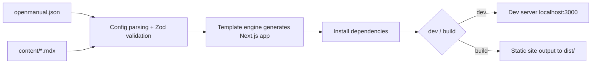

# OpenManual

An AI-friendly open-source documentation framework. Simply write Markdown/MDX documents and JSON configuration to automatically generate a complete Next.js-based documentation site.

## Features

- **Zero-config start** — Only a `name` field and `content/index.mdx` are needed to get started
- **Code generation** — Generates Next.js applications via template engine; users never touch framework code
- **Zod validation** — Configuration files use Zod Schema for strict validation with clear error messages
- **Flexible navigation** — Multi-group sidebar, custom icons, collapse control
- **Theme customization** — Adjust brand color easily via `primaryHue` hue value
- **Full-text search** — Built-in search, enabled with one line of config
- **MDX enhancements** — Supports React components, LaTeX formulas
- **AI-native design** — Pure JSON config + Markdown content, ideal for AI-assisted generation

## How It Works



1. **Read config** — Parse `openmanual.json`, validate all fields using Zod Schema
2. **Load content** — Scan all MDX files under `contentDir`
3. **Generate app** — Generate complete Next.js application to temp directory via template engine
4. **Link content** — Symlink user content directory and static assets to generated directory
5. **Install dependencies** — Auto-install npm dependencies required by generated app
6. **Start/Build** — Start dev server or build static artifacts

## Project Structure

A typical OpenManual project structure:

```
my-docs/
├── openmanual.json       # Config file
├── content/              # Documentation content directory
│   ├── index.mdx         # Homepage
│   ├── getting-started.mdx
│   └── advanced/
│       ├── theme.mdx
│       └── search.mdx
└── public/               # Static assets (optional)
    └── logo.svg
```

## Next Steps

- [Quick Start](/quickstart) — Create your first documentation site in 5 minutes
- [Configuration Reference](/guide/configuration) — Learn about all available configuration options
- [Writing Docs](/guide/writing-docs) — Learn how to write and organize documentation content
