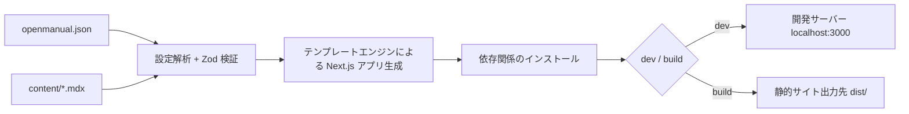

# OpenManual

AI に優しいオープンソースドキュメントシステムフレームワーク。Markdown/MDX ドキュメントと JSON 設定を記述するだけで、Next.js ベースの完全なドキュメントサイトを自動生成できます。

## 特徴

- **ゼロコンフィグで始められる** — 最小限 `name` フィールドと `content/index.mdx` だけで起動可能
- **コード生成モード** — テンプレートエンジンで Next.js アプリケーションを生成するため、ユーザーはフレームワークコードに触れる必要がありません
- **Zod バリデーション** — 設定ファイルは Zod Schema で厳密に検証され、エラーメッセージも明確です
- **柔軟なナビゲーション** — 複数グループのサイドバー、カスタムアイコン、折りたたみ制御に対応
- **テーマカスタマイズ** — `primaryHue` の色相値でブランドカラーを簡単に調整
- **全文検索** — 組み込み検索機能、1行の設定で有効化
- **MDX 拡張** — React コンポーネント、LaTeX 数式に対応
- **AI ネイティブ設計** — 純粋な JSON 設定 + Markdown コンテンツで、AI による生成と非常に相性が良い

## 仕組み



1. **設定の読み込み** — `openmanual.json` を解析し、Zod Schema ですべてのフィールドを検証
2. **コンテンツの読み込み** — `contentDir` 配下のすべての MDX ファイルをスキャン
3. **アプリケーションの生成** — テンプレートエンジンで完全な Next.js アプリケーションを一時ディレクトリに生成
4. **コンテンツのリンク** — ユーザーのコンテンツディレクトリと静的アセットを生成ディレクトリにシンボリックリンク
5. **依存関係のインストール** — 生成されたアプリに必要な npm 依存関係を自動インストール
6. **起動/ビルド** — 開発サーバーの起動または静的アーティファクトのビルド

## プロジェクト構造

典型的な OpenManual ユーザープロジェクトの構造は以下の通りです：

```
my-docs/
├── openmanual.json       # 設定ファイル
├── content/              # ドキュメントコンテンツディレクトリ
│   ├── index.mdx         # トップページ
│   ├── getting-started.mdx
│   └── advanced/
│       ├── theme.mdx
│       └── search.mdx
└── public/               # 静的アセット（オプション）
    └── logo.svg
```

## 次のステップ

- [クイックスタート](/quickstart) — 5分で最初のドキュメントサイトを作成
- [設定リファレンス](/guide/configuration) — 利用可能なすべての設定オプションを確認
- [ドキュメント作成](/guide/writing-docs) — ドキュメントコンテンツの作成・整理方法を学ぶ
