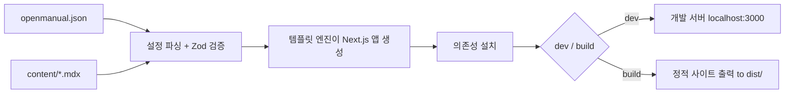

# OpenManual

AI 친화적인 오픈 소스 문서 시스템 프레임워크. Markdown/MDX 문서와 JSON 설정만 작성하면 Next.js 기반의 완전한 문서 사이트를 자동으로 생성합니다.

## 기능

- **영 설정 시작** — 최소 `name` 필드와 `content/index.mdx`만으로 시작 가능
- **코드 생성 모드** — 템플릿 엔진을 통해 Next.js 앱을 생성하며, 사용자가 프레임워크 코드를 직접 다룰 필요 없음
- **Zod 검증** — 설정 파일은 Zod Schema로 엄격하게 검증되며, 오류 메시지가 명확함
- **유연한 네비게이션** — 다중 그룹 사이드바, 사용자 정의 아이콘, 접기 제어 지원
- **테마 커스터마이징** — `primaryHue` 색상 값으로 브랜드 색상을 쉽게 조정
- **전문 검색** — 내장 검색 기능, 한 줄 설정으로 활성화
- **MDX 강화** — React 컴포넌트, LaTeX 수식 지원
- **AI 네이티브 설계** — 순수 JSON 설정 + Markdown 콘텐츠로 AI 보조 생성에 매우 적합

## 작동 원리



1. **설정 읽기** — `openmanual.json`을 파싱하고 Zod Schema로 모든 필드를 검증
2. **콘텐츠 로드** — `contentDir` 아래의 모든 MDX 파일 스캔
3. **앱 생성** — 템플릿 엔진을 통해 임시 디렉토리에 완전한 Next.js 앱 생성
4. **콘텐츠 연결** — 사용자 콘텐토리와 정적 리소스를 생성된 디렉토리에 심볼릭 링크
5. **의존성 설치** — 생성된 앱에 필요한 npm 의존성 자동 설치
6. **시작/빌드** — 개발 서버 시작 또는 정적 산출물 빌드

## 프로젝트 구조

일반적인 OpenManual 사용자 프로젝트 구조는 다음과 같습니다:

```
my-docs/
├── openmanual.json       # 설정 파일
├── content/              # 문서 콘텐츠 디렉토리
│   ├── index.mdx         # 홈페이지
│   ├── getting-started.mdx
│   └── advanced/
│       ├── theme.mdx
│       └── search.mdx
└── public/               # 정적 리소스 (선택 사항)
    └── logo.svg
```

## 다음 단계

- [빠른 시작](/quickstart) — 5분 만에 첫 번째 문서 사이트 생성
- [설정 참조](/guide/configuration) — 사용 가능한 모든 설정 옵션 확인
- [문서 작성](/guide/writing-docs) — 문서 콘텐츠 작성 및 구성 방법 학습
