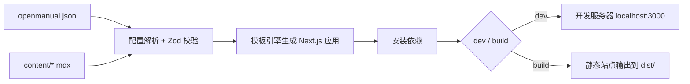

## 特性

- **零配置起步** — 最小只需 `name` 字段和 `content/index.mdx` 即可启动
- **代码生成模式** — 通过模板引擎生成 Next.js 应用，用户无需接触框架代码
- **Zod 校验** — 配置文件使用 Zod Schema 严格校验，错误提示清晰
- **灵活导航** — 支持多分组侧边栏、自定义图标、折叠控制
- **主题定制** — 通过 `primaryHue` 色相值轻松调整品牌色
- **全文搜索** — 内置搜索功能，一行配置开启
- **MDX 增强** — 支持 React 组件、LaTeX 公式
- **AI 原生设计** — 纯 JSON 配置 + Markdown 内容，非常适合 AI 辅助生成

## 工作原理



1. **读取配置** — 解析 `openmanual.json`，使用 Zod Schema 校验所有字段
2. **加载内容** — 扫描 `contentDir` 下的所有 MDX 文件
3. **生成应用** — 通过模板引擎生成完整的 Next.js 应用到临时目录
4. **链接内容** — 将用户内容目录和静态资源符号链接到生成目录
5. **安装依赖** — 自动安装生成应用所需的 npm 依赖
6. **启动/构建** — 启动开发服务器或构建静态产物

## 项目结构

一个典型的 OpenManual 用户项目结构如下：

```
my-docs/
├── openmanual.json       # 配置文件
├── content/              # 文档内容目录
│   ├── index.mdx         # 首页
│   ├── getting-started.mdx
│   └── advanced/
│       ├── theme.mdx
│       └── search.mdx
└── public/               # 静态资源（可选）
    └── logo.svg
```

## 下一步

- [快速上手](/quickstart) — 5 分钟创建你的第一个文档站点
- [配置参考](/guide/configuration) — 了解所有可用的配置选项
- [编写文档](/guide/writing-docs) — 学习如何编写和组织文档内容
